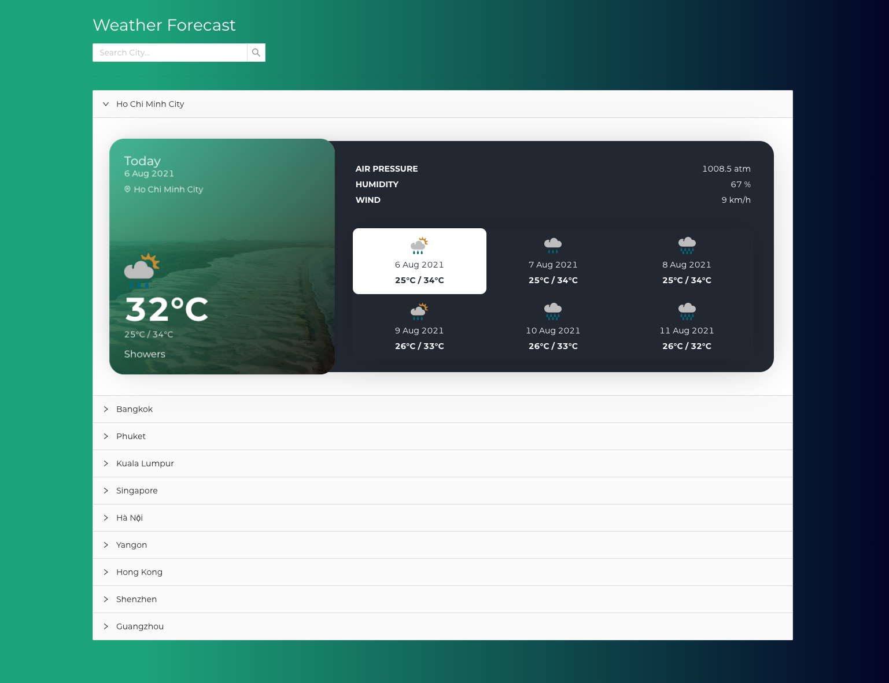

# Weather Forecast Simple 🌦



This project was bootstrapped with [Create React App](https://github.com/facebook/create-react-app).

## Introduction
Weather Forecast App is the app for visualizing location weather data by using Metaweather API.

## Features
 - Detect location
 - Search location
 - List locations
 - Details location weather in next 5 days
 - Select weather day to see detail information
 - Avoid duplicate call for weather detail
 - Reponsive UI

## Frontend Stacks
 - React
 - React Hooks
 - Redux Toolkit
 - Redux Saga
 - Jest
 - Cypress
 - React Testing Library
 - Ant Design
 - Dayjs
 - Eslint
 - Lodash
 - Geolocation API
 - Babel

## Testing
 - Unit Tests
 - Integration Tests
 - End-to-End Tests

## Project Structure

Most of the code lives in the `src` folder and looks like this:

```
src
|
+-- assets            # assets folder can contain all the static data such as images, fonts, etc.
|
+-- components        # shared components used across the entire application
|
+-- config            # all the global configuration, env variables etc. get exported from here and used in the app
|
+-- container         # feature based modules
|
+-- hooks             # shared hooks used across the entire application
|
+-- routes            # routes configuration
|
+-- store             # configuration redux store, reducer, middlewares redux saga
|
+-- utils             # shared utility functions
```

## Before Start
  - Note that Metaweather Api [https://www.metaweather.com/api/](https://www.metaweather.com/api/) has't been included cors.
  - Created a proxy-server to handle Metaweather Api. By go to folder `proxy-server` and `npm install` then start it by `npm start`

## Available Scripts

In the project directory, you can run:

#### `npm install`
Install Project.

#### `npm start`

Runs the app in the development mode.\
Open [http://localhost:3000](http://localhost:3000) to view it in the browser.

The page will reload if you make edits.\
You will also see any lint errors in the console.

#### `npm test`

Launches the test runner in the interactive watch mode.

#### `npm run cy:open`
Run E2E tests

#### `npm run build`

Builds the app for production to the `build` folder.\
It correctly bundles React in production mode and optimizes the build for the best performance.

The build is minified and the filenames include the hashes.\
Your app is ready to be deployed!

## Learn More

You can learn more in the [Create React App documentation](https://facebook.github.io/create-react-app/docs/getting-started).

To learn React, check out the [React documentation](https://reactjs.org/).

### Code Splitting

This section has moved here: [https://facebook.github.io/create-react-app/docs/code-splitting](https://facebook.github.io/create-react-app/docs/code-splitting)

### Analyzing the Bundle Size

This section has moved here: [https://facebook.github.io/create-react-app/docs/analyzing-the-bundle-size](https://facebook.github.io/create-react-app/docs/analyzing-the-bundle-size)

### Making a Progressive Web App

This section has moved here: [https://facebook.github.io/create-react-app/docs/making-a-progressive-web-app](https://facebook.github.io/create-react-app/docs/making-a-progressive-web-app)

### Advanced Configuration

This section has moved here: [https://facebook.github.io/create-react-app/docs/advanced-configuration](https://facebook.github.io/create-react-app/docs/advanced-configuration)

### Deployment

This section has moved here: [https://facebook.github.io/create-react-app/docs/deployment](https://facebook.github.io/create-react-app/docs/deployment)

### `npm run build` fails to minify

This section has moved here: [https://facebook.github.io/create-react-app/docs/troubleshooting#npm-run-build-fails-to-minify](https://facebook.github.io/create-react-app/docs/troubleshooting#npm-run-build-fails-to-minify)
